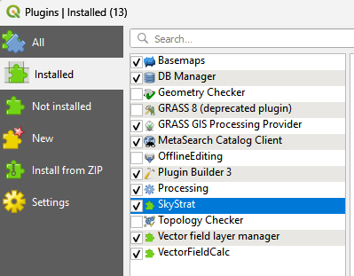

# SkyStrat

SkyStrat is a GIS platform for mapping stratigraphic height by fitting cylindrical fold geometry to structural measurements.
Structural measurements (strikes/dips) can be measured in the field or calculated by SkyStrat solving a three-point problem.

For more information, see the provided video tutorials.

## Get the code

Download an archive from the [Releases](https://github.com/mitchellmcm27/SkyStrat/releases), or clone this repository. 

To download a release from this page, go to [Releases](https://github.com/mitchellmcm27/SkyStrat/releases), go to the latest version, click the arrow next to Assets, and click the source code in your preferred format to download. Then, unzip. There are several files in the main folder and three subfolders. The files in the main folder include:

+ SkyStrat User Guide.pdf - a more detailed description of what each of the tools do, their inputs and outputs, etc.
+ SkyStrat.mp4 - a demonstration video showing use of the tool for mapping stratigraphic height in ArcGIS Pro.
+ threepointproblemtoolbox.mp4 - a demonstration video showing use of the ThreePointProblem tool for calculating strikes and dips from digital topography in ArcGIS Pro.
+ README.md - this file.

The subfolders include:

+ arc/ - folder with the files to run the algorithms in ArcGIS Pro.
+ qgis/ - folder with the files to run the algorithms in QGIS.
+ example_data/ - folder with example files showing input and output of the tool, created in ArcGIS Pro. The provided input files can be used with the scripts to replicate the provided output examples.


Use the instructions below to install. Note, the ArcGIS Pro and QGIS versions are alternatives to one another with (approximately) the same functionality. Use whichever one you prefer.

## Arc GIS Plugin installation

To use these tools, you will need to locate `SkyStrat.pyt` for the Busk method algorithm for calculating and mapping stratigraphic height, and `ThreePointProblemToolbox.pyt` for the three-point problem method for calculating strike and dip from three points and a digital elevation model. 

First, download these or unzip the release, whichever you prefer. Place these files into a folder that you plan to locate from within ArcCatalog inside ArcGIS Pro. Open the Catalog pane in ArcGIS Pro. Under "Folders", navigate to the `SkyStrat.pyt` and/or `ThreePointProblemToolbox.pyt` files where you saved them. 
Right click, and choose `Add To Project`.

Open the Geoprocessing/Tools Pane, click `Toolboxes` between `Favorites` and `Portal` at the top of the pane, and the added toolboxes will appear under the `Project` heading. Expand the toolbox menu items, and click the title next to the script icon to launch each tool. They should also be findable by search in the Geoprocessing/Tools pane. 

Use the PDF guide and the demonstration videos in the main folder for guidance on use of the tools.

## QGIS Plugin installation

Installing a local plugin requires copying the files to the QGIS **python\plugins** directory.
The easist way to develop a plugin is to create a symlink, which allows changes to be automatically synced to the correct directory without manually copying files.

After copying or symlinking, restart QGIS, and then enable the "SkyStrat" plugin in this QGIS plugins manager.



The plugins will be available in the **Processing Toolbox** under the *SkyStrat* menu item.

To uninstall, delete the `SkyStrat` symlink in the **QGIS3/profiles/default/python/plugins** folder.

## Interpreting the Results

The ArcGIS Pro version of the script generates four outputs.


### Windows symlink

cmd prompt (run as Admin):

```cmd
mklink /D "C:\Users\<username>\AppData\Roaming\QGIS\QGIS3\profiles\default\python\plugins\SkyStrat" "C:\Path\To\This\Repo\SkyStrat\qgis\SkyStrat"
```

Powershell (run as Admin):

```powershell
New-Item -ItemType SymbolicLink -Path "C:\Users\<username>\AppData\Roaming\QGIS\QGIS3\profiles\default\python\plugins\SkyStrat" -Target "C:\Path\To\This\Repo\SkyStrat\qgis\SkyStrat"
```

### Mac symlink (not yet tested)

```bash
ln -s /path/to/this/repo/SkyStrat/qgis/SkyStrat ~/Library/Application\ Support/QGIS/QGIS3/profiles/default/python/plugins/SkyStrat
```

### Linux symlink (not yet tested)

```bash
ln -s /path/to/this/repo/SkyStrat/qgis/SkyStrat ~/.local/share/QGIS/QGIS3/profiles/default/python/plugins/SkyStrat
```
